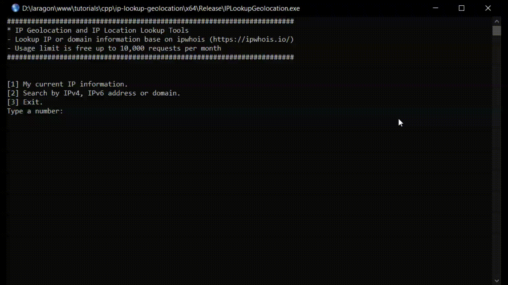

# IP Lookup Geolocation
IP Geolocation and IP Location Lookup Tools Console App



Requirements:
1. [Microsoft Visual Studio IDE](https://visualstudio.microsoft.com/)
2. [vcpkg - C/C++ dependency manager from Microsoft](https://vcpkg.io/)
3. Install "curl" package via vcpkg
```
.\vcpkg install curl
```
4. Install "nlohmann-json" package via vcpkg
```
.\vcpkg install nlohmann-json
```
